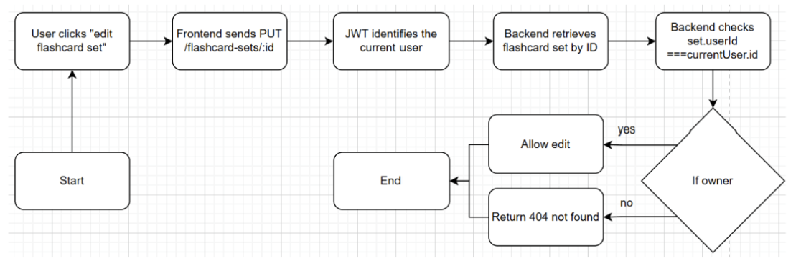
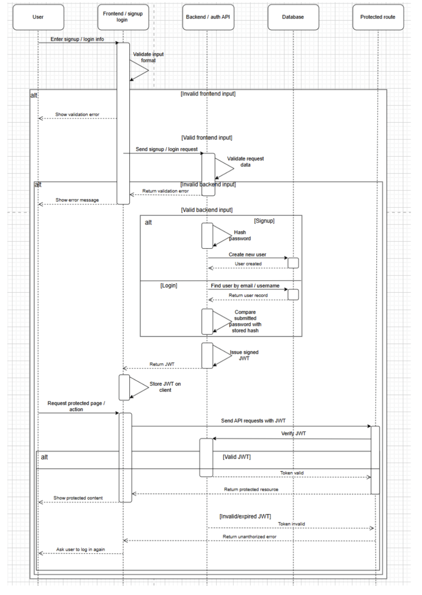

# CS35L Group Project - Testable
## Eric Chen, Emily Lyday, Boyuan Li, Aaron Zhang, Jasmine Lopez

Testable is a web-based flashcard platform that lets students create, organise, and study custom digital flashcard sets. Users can author their own question-and-answer cards, organise them into named sets, and work through them using an interactive flip-card study mode. Sets can optionally be published so the broader community can search for and learn from them and copy them into their own libraries for personalisation.
Flashcards remain one of the most research-backed study methods (spaced repetition, active recall), yet most existing tools are either too complex, paywalled, or locked to proprietary content libraries. Testable fills this gap by combining frictionless creation, community sharing, and progress tracking in a clean, open interface. We believe this makes Testable genuinely useful from day one while providing a rich feature roadmap to explore over the quarter.

### general workflow:
- create feature branch
- make small commits w/ descriptive commit messages
- merge main into branch frequently to avoid large merge conflicts
- once feature is completed (acceptance criteria is met), make pull request into main
- have at least one group member perform a review on the pr before merging into main (checking that acceptance criteria is met)

## Running the App Locally

## Prerequisites

Install the following before running the app:
- Node.js 20 or newer
- npm, which is included with Node.js

Check that they're installed:

```bash
node --version
npm --version
```

## Local Setup

First clone the repo to your local device with `git clone https://github.com/ericchen682/Testable.git` inside a folder. Then open your terminal, cd to the cloned project path, and run `code .` from the project root.

Run the following commands from the project root unless stated otherwise.

### 1. Install Backend Dependencies

```bash
cd server
npm install
```

### 2. Create Backend Environment File

Create `server/.env`:
```bash
JWT_SECRET=long-random-secret
PORT=3001
RESEND_API_KEY=resend-api-key
CLIENT_URL=http://localhost:5173
```

`PORT` is optional because the server defaults to `3001`. `CLIENT_URL` is used for password reset email links and defaults to `http://localhost:5173`.

### 3. Start the Backend and Database

Under `server`, run:
```bash
npm start
```

Expected output:
```text
SQLite database ready at data/testable.db
Server running on http://localhost:3001
```

`npm start` runs `npm prestart`, which initializes the database files. So database initialization doesn't need to be addressed separately.

Leave this terminal running.

### 4. Install Frontend Dependencies

Open a second terminal, run:
```bash
cd client
npm install
```

### 5. Start the Frontend

Under `client`, run:
```bash
npm run dev
```

Vite will print a local URL:
```text
http://localhost:5173
```

Open that URL in your browser.

## Summary

You need two terminals:

Terminal 1:
```bash
cd server
npm start
```

Terminal 2:
```bash
cd client
npm run dev
```

## Troubleshooting

- If signup or login fails immediately, check that `server/.env` exists and includes `JWT_SECRET`
- If the frontend loads but API requests fail, make sure the backend is running at `http://localhost:3001`
- If port `3001` is already in use, either stop the other process or change the backend `PORT`. If you change the backend port, update the hardcoded frontend fetch URLs in `client/src/pages`
- If the database contains bad test data, stop the backend, delete `server/data/testable.db`, and restart it
- If dependencies fail to install, confirm that you are using Node.js 20 or newer, then rerun `npm install` separately inside both `server/` and `client/`.

### edit flashcards user flow diagram:



### user authentication sequence diagram:

